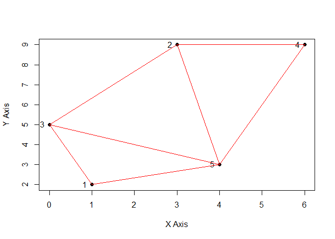

<!-- README.md is generated from README.Rmd. Please edit that file -->

# trianglegsoc

<!-- badges: start -->
<!-- badges: end -->

A sample package created as a preliminary GSoC 2022 task. It calculates
the Standard Delaunay Triangulation of 5 points

## Installation

You can install the development version of trianglegsoc here:

``` r
devtools::install_github("ZeroDawn0D/trianglegsoc")
```

## Examples

The function to calculate a Standard Delaunay Triangulation:

``` r
trianglegsoc::run_DT() 
trianglegsoc::run_DT(limit = 3) #stops execution after drawing 3 triangles
```

Input can also be provided beforehand

``` r
trianglegsoc::run_DT(input = matrix(c(1,2,3,9,0,5,6,9,4,3), ncol = 5, byrow = FALSE))
#>      [,1] [,2] [,3] [,4] [,5]
#> [1,]    1    3    0    6    4
#> [2,]    2    9    5    9    3
```


